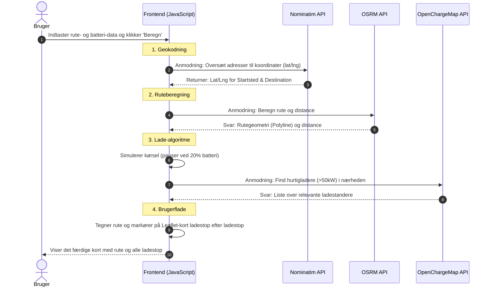

# Teknisk Dokumentation: EV Route Planner

Dette dokument beskriver den tekniske arkitektur, filstruktur og de eksterne integrationer for "EV Route Planner". Systemet er udviklet som en del af eksamensprojektet i M6 (Design af IT-baserede systemer) på IT-Ledelse, Aalborg Universitet.

---

## 1. Systemarkitektur
Systemet er bygget som en **Client-side/Frontend webapplikation**. Vi har valgt en arkitektur, hvor systemet ikke har sin egen server eller database (backend) i denne MVP version. I stedet afvikles logikken direkte i brugerens browser via JavaScript. 

Denne arkitektur er valgt for at holde systemet simpelt og uafhængigt af server- og databaseopsætninger. Systemets data og beregninger foregår via integrationer med API'er.

**Teknologier:**
* **Struktur:** HTML5
* **Styling:** CSS3
* **Logik:** JavaScript

---

## 2. Eksterne Integrationer (API'er & Biblioteker)
Da vi ikke har udviklet vores egen backend til at beregne ruter eller opbevare data om ladestandere osv., er systemet dybt afhængigt af tredjepartstjenester der kan bidrage med den viden. Følgende services benyttes:

### 2.1 Nominatim (OpenStreetMap)
* **Formål:** Geocoding.
* **Brug:** Omdanner brugerinput; bynavne eller adresser til præcise længde- og breddegrader (lat/lng), som systemet kan regne videre på og er det vi sender til OSRM når der skal beregnes rute.

### 2.2 OSRM (Open Source Routing Machine)
* **Formål:** Ruteberegning.
* **Brug:** Modtager start- og slutkoordinater og returnerer den hurtigste kørerute (polyline) samt den totale distance.

### 2.3 OpenChargeMap API
* **Formål:** Fremsøgning af ladestandere.
* **Brug:** Bruges til at finde ladestationer langs ruten. Vi har implementeret et filter (`minpowerkw=50`), der prioriterer hurtigladere (50+ kW).

### 2.4 Leaflet.js
* **Formål:** Visuel kortfremstilling.
* **Brug:** Et Open-Source bibliotek, der bruges til at rendere det interaktive kort, tegne ruten og placere markører for start, slut og alle de ladestop der er imellem.

---

## 3. Rute- og Ladealgoritme
Hovedlogikken findes i funktionen `findRoute()`. Algoritmen håndterer to primære scenarier for ladeplanlægning:

1. **Manuelt tvungne stop:** Dividerer rutens totale distance med det ønskede antal pauser og placerer ladestop med jævne mellemrum.
2. **Automatisk beregning (0 stop):** Simulerer bilens strømforbrug undervejs. Når batteriet når en kritisk grænse (20%), finder algoritmen den nærmeste ladestander via OpenChargeMap, "lader" bilen op til 80%, og fortsætter derefter turen.

---

## 4. Systemflow (Sekvensdiagram)
For at visualisere interaktionen mellem brugeren, systemets frontend og de forskellige tredjeparts-API'er, har vi udarbejdet et UML-sekvensdiagram. Diagrammet illustrerer den præcise rækkefølge af de asynkrone kald, der foretages, når en bruger anmoder om en ruteberegning.

Diagrammet er udarbejdet i low-code værktøjet **mermaid.live**, hvilket gør det muligt at indlejre diagrammet direkte som kode i Markdown-dokumentationen og derved sikre at det kommunikeres samlet.

---

## 5. Logikkens-flow (Aktivitetsdiagram)
Hvor sekvensdiagrammet kortlægger den eksterne kommunikation med tredjepartstjenester (Nominatim til koordinater, OSRM til vores polyline og OCM til ladestandere), så zoomer dette UML-aktivitetsdiagram helt ind på den interne programlogik, vores if/else-logik, samt håndteringen af manuelle stop i `findRoute()` funktionen. 

Diagrammet afspejler vores systematiske sikring af systemets ikke-funktionelle krav om stabilitet og robusthed over for edge-cases (start batteri under 20%). Det er ligeledes indlejret direkte via Mermaid-syntaks:

```mermaid
---
config:
  layout: dagre
---
flowchart TB
    Start@{ label: "Start: Bruger klikker på 'Beregn'" } --> ClearMap["Kald clearMap: Fjern tidligere ruter og markører"]
    ClearMap --> Geocode["Anmod Nominatim API: Oversæt Start og Destination til Lat/Lng"]
    Geocode --> FetchRoute["Anmod OSRM API: Hent rutegeometri polyline og total distance"]
    FetchRoute --> DrawRoute["Tegn rute-polyline på Leaflet-kort og placer start/slut markører"]
    DrawRoute --> DecisionStop{"Er Tving antal stop > 0?"}
    DecisionStop -- Ja --> CalcLeg["Beregn fast etapedistance: Total distance / (antal stop + 1)"]
    CalcLeg --> LoopManuel["Loop igennem rutens koordinater"]
    LoopManuel --> CheckLeg{"Er etapedistance nået?"}
    NextCoordM["Gå til næste koordinat"] --> LoopManuel
    CheckLeg -- Ja --> FetchManualCharger["Anmod OpenChargeMap API: Find nærmeste lader"]
    FetchManualCharger --> AddMarkerM["Placer lademarkør på Leaflet-kort"]
    AddMarkerM --> CheckAllStops{"Er alle tvungne stop placeret?"}
    CheckAllStops -- Nej --> NextCoordM
    CheckAllStops -- Ja --> UI_Output["Generer rejsestatistik og ladestop-oversigt i HTML"]
    DecisionStop -- Nej --> CheckEmergency{"Er start-batteri &lt;= 20%?"}
    CheckEmergency -- Ja --> EmergencyStop["Placer akut lademarkør ved start og sæt batteri = 80%"]
    CheckEmergency -- Nej --> InitAuto["Initialiser: Batteri = Start-%, Etape-dist = 0"]
    EmergencyStop --> InitAuto
    InitAuto --> LoopAuto["Loop igennem rutens koordinater"]
    LoopAuto --> AccumulateDist["Akkumuler distance mellem koordinater"]
    AccumulateDist --> CalcRange["Beregn brugbar rækkevidde baseret på aktuelt batteri ned til 20%"]
    CalcRange --> CheckBatteryCrit{"Akkumuleret distance >= Brugbar rækkevidde?"}
    CheckBatteryCrit -- Ja --> FetchAutoCharger["Anmod OpenChargeMap API: Find hurtiglader (>50kW)"]
    FetchAutoCharger --> AddMarkerA["Placer lademarkør på Leaflet-kort"]
    AddMarkerA --> ResetBattery["Sæt batteri = 80% og nulstil akkumuleret etapedistance"]
    ResetBattery --> CheckDestReached{"Er destinationen nået?"}
    CheckBatteryCrit -- Nej --> CheckDestReached
    CheckDestReached -- Nej --> NextCoordA["Gå til næste koordinat"]
    NextCoordA --> LoopAuto
    CheckDestReached -- Ja --> UI_Output
    UI_Output --> End(["Slut: Systemet er klar til brug"])
    CheckLeg -- Nej --> NextCoordM

    Start@{ shape: stadium}
     Start:::startEnd
     ClearMap:::process
     Geocode:::process
     FetchRoute:::process
     DrawRoute:::process
     DecisionStop:::decision
     CalcLeg:::process
     LoopManuel:::process
     CheckLeg:::decision
     NextCoordM:::process
     FetchManualCharger:::process
     AddMarkerM:::process
     CheckAllStops:::decision
     UI_Output:::process
     CheckEmergency:::decision
     EmergencyStop:::process
     InitAuto:::process
     LoopAuto:::process
     AccumulateDist:::process
     CalcRange:::process
     CheckBatteryCrit:::decision
     FetchAutoCharger:::process
     AddMarkerA:::process
     ResetBattery:::process
     CheckDestReached:::decision
     NextCoordA:::process
     End:::startEnd
    classDef startEnd fill:#1e293b,stroke:#334155,stroke-width:2px,color:#fff
    classDef process fill:#f8fafc,stroke:#cbd5e1,stroke-width:1px
    classDef decision fill:#e2e8f0,stroke:#94a3b8,stroke-width:2px
```

---

## 6. Filstruktur og Komponenter
Projektet er opdelt for at sikre overskuelighed og muliggøre parallelt arbejde i gruppen.

**HTML (Sider):**
* `index.html` - Systemets kerne (Ruteplanlæggeren).
* `how_to.html` - Brugervejledning og teknisk overblik.
* `about_us.html` - Præsentation af projektet og projektteamet.
* `contact.html` - Kontaktoplysninger.

**CSS (Styling):**
* `style.css` - Global styling (Header, Footer, Navigation, Typografi).
* `route_map.css` - App-specifik styling til kort og indtastningsfelter.

---

## 7. Setup Guide / Installation
For at sikre, at JavaScript `fetch()`-kald til eksterne API'er ikke blokeres af browserens CORS-sikkerhedspolitikker, skal systemet afvikles via en lokal webserver frem for at åbne filerne direkte ved at dobbelt-klikke på en HTML-fil.
### Afhængigheder og Systemkrav
For at systemet kan afvikles korrekt, kræves følgende:
* **Python 3:** Bruges udelukkende som værktøj til at køre en lokal webserver-instans. Dette er nødvendigt for at tildele applikationen et gyldigt "Origin" (`http://localhost`), så browserens CORS-sikkerhedsregler tillader kommunikation med eksterne API'er.
* **Internetforbindelse:** Nødvendig for at kunne fetche data fra OSRM, Nominatim og OpenChargeMap, da systemet er bygget på en distribueret arkitektur uden lokal database.

**Sådan køres systemet:**
1. Klon repository'et fra GitHub: 
   `git clone https://github.com/Nethrex/M6-Projekt/tree/main`
2. Åbn en terminal i projektmappen.
3. Start en lokal webserver via Python ved at køre følgende kommando:
   `python3 -m http.server 8000`
4. Åbn din browser og gå til: `http://localhost:8000`
5. Systemet er nu kørende med fuld adgang til alle API-integrationer.
