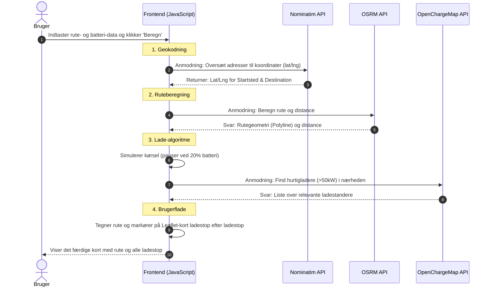

# Teknisk Dokumentation: EV Route Planner

Dette dokument beskriver den tekniske arkitektur, filstruktur og de eksterne integrationer for "EV Route Planner". Systemet er udviklet som en del af eksamensprojektet i M6 (Design af IT-baserede systemer) på IT-Ledelse, Aalborg Universitet.

---

## 1. Systemarkitektur
Systemet er bygget som en **Client-side/Frontend webapplikation**. Vi har valgt en statisk arkitektur, hvilket betyder, at systemet ikke har sin egen server eller database (backend). I stedet afvikles al forretningslogik direkte i brugerens browser via Vanilla JavaScript. 

Denne arkitektur er valgt for at holde systemet letvægtigt, hurtigt og uafhængigt af komplekse server-opsætninger. Systemets data- og beregningsbehov dækkes ved at integrere med eksterne REST API'er (Microservices-lignende tilgang).

**Teknologier:**
* **Struktur:** HTML5
* **Styling:** CSS3 (Custom grids og flexbox)
* **Logik:** Vanilla JavaScript (ES6+ med asynkrone funktioner / `async/await`)

---

## 2. Eksterne Integrationer (API'er & Biblioteker)
Da vi ikke har vores egen backend til at beregne ruter eller opbevare data om ladestandere, er systemet dybt afhængigt af tredjepartstjenester. Følgende services benyttes:

### 2.1 Nominatim (OpenStreetMap)
* **Formål:** Geocoding.
* **Brug:** Omdanner brugerindtastede bynavne eller adresser til præcise længde- og breddegrader (lat/lng), som systemet kan regne videre på.

### 2.2 OSRM (Open Source Routing Machine)
* **Formål:** Ruteberegning.
* **Brug:** Modtager start- og slutkoordinater og returnerer den hurtigste kørerute (geometry) samt den totale distance.

### 2.3 OpenChargeMap API
* **Formål:** Fremsøgning af ladestandere.
* **Brug:** Bruges til at finde ladestationer langs ruten. Vi har implementeret et filter (`minpowerkw=50`), der prioriterer hurtigladere (50+ kW), hvilket er mest relevant på en roadtrip.

### 2.4 Leaflet.js
* **Formål:** Visuel kortfremstilling.
* **Brug:** Et Open-Source bibliotek, der bruges til at rendere det interaktive kort, tegne ruten og placere markører for start, slut og ladestop.

---

## 3. Rute- og Ladealgoritme
Hovedlogikken findes i funktionen `findRoute()`. Algoritmen håndterer to primære scenarier for ladeplanlægning:

1. **Manuelt tvungne stop:** Dividerer rutens totale distance med det ønskede antal pauser og placerer ladestop med jævne mellemrum.
2. **Automatisk beregning (0 stop):** Simulerer bilens strømforbrug undervejs. Når batteriet når en kritisk grænse (20%), finder algoritmen den nærmeste ladestander via OpenChargeMap, "lader" bilen op til 80%, og fortsætter derefter turen.

---

## 4. Systemflow (UML Sekvensdiagram)
For at visualisere interaktionen mellem brugeren, systemets frontend og de forskellige tredjeparts-API'er, har vi udarbejdet et UML-sekvensdiagram. Diagrammet illustrerer den præcise rækkefølge af de asynkrone kald, der foretages, når en bruger anmoder om en ruteberegning.

Diagrammet er udarbejdet i det kodedrevne værktøj **mermaid.live**, hvilket gør det muligt at indlejre diagrammet direkte som kode i Markdown-dokumentationen og derved sikre nem opdatering og versionstyring.

---

## 5. Filstruktur og Komponenter
Projektet er opdelt for at sikre overskuelighed og muliggøre parallelt arbejde i gruppen.

**HTML (Sider):**
* `index.html` - Systemets kerne (Ruteplanlæggeren).
* `how_to.html` - Brugervejledning og teknisk overblik.
* `about_us.html` - Præsentation af projektet og projektteamet.
* `contact.html` - Kontaktoplysninger.

**CSS (Styling):**
* `style.css` - Global styling (Header, Footer, Navigation, Typografi).
* `route_map.css` - App-specifik styling til kort og indtastningsfelter.

---

## 6. Setup Guide / Installation
For at sikre, at JavaScript `fetch()`-kald til eksterne API'er ikke blokeres af browserens CORS-sikkerhedspolitikker, skal systemet afvikles via en lokal webserver frem for at åbne filerne direkte via `file://` protokollen.

**Sådan køres systemet:**
1. Klon repository'et fra GitHub: 
   `git clone [jeres-github-url]`
2. Åbn en terminal i projektmappen.
3. Start en lokal webserver via Python ved at køre følgende kommando:
   `python3 -m http.server 8000`
   *(På Windows benyttes ofte blot `python -m http.server 8000`)*.
4. Åbn din browser og gå til: `http://localhost:8000`
5. Systemet er nu køreklar med fuld adgang til alle API-integrationer.